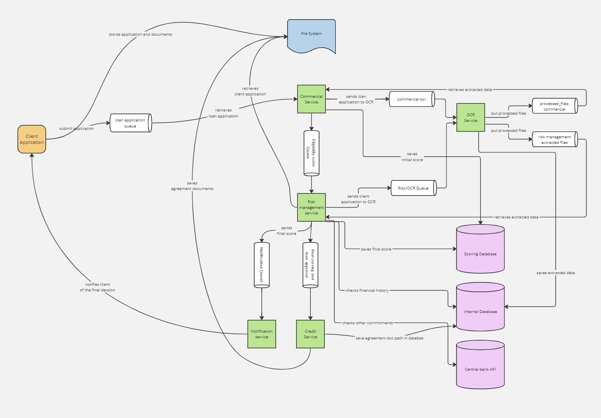
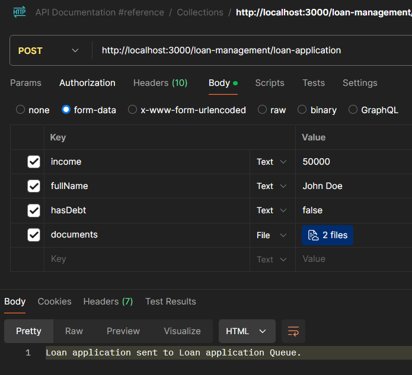
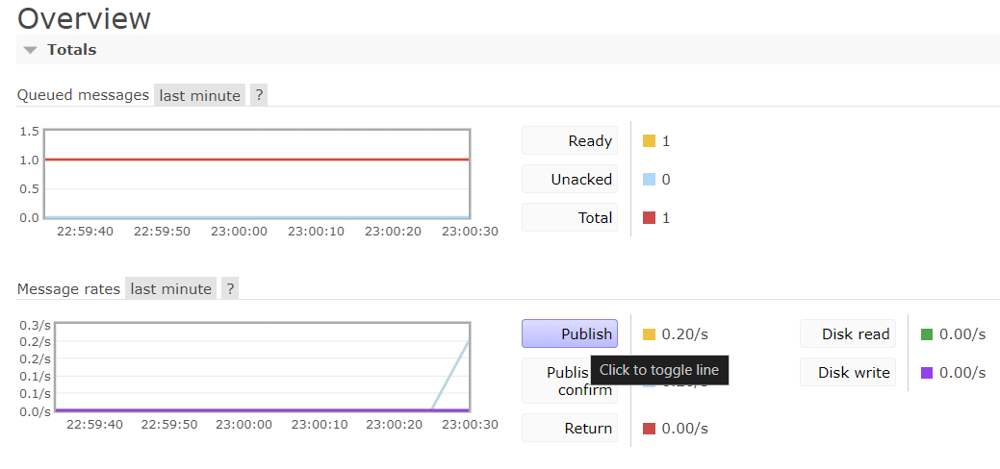
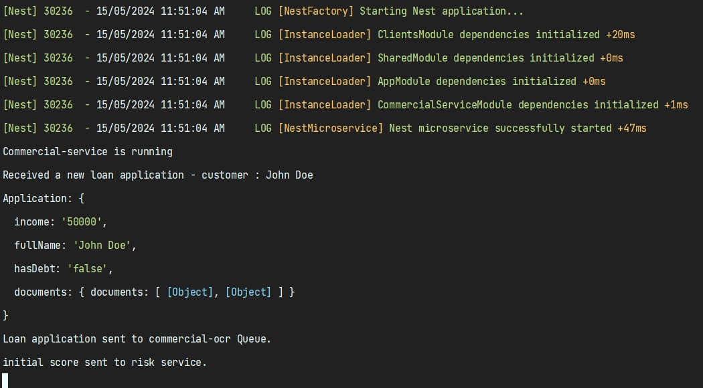
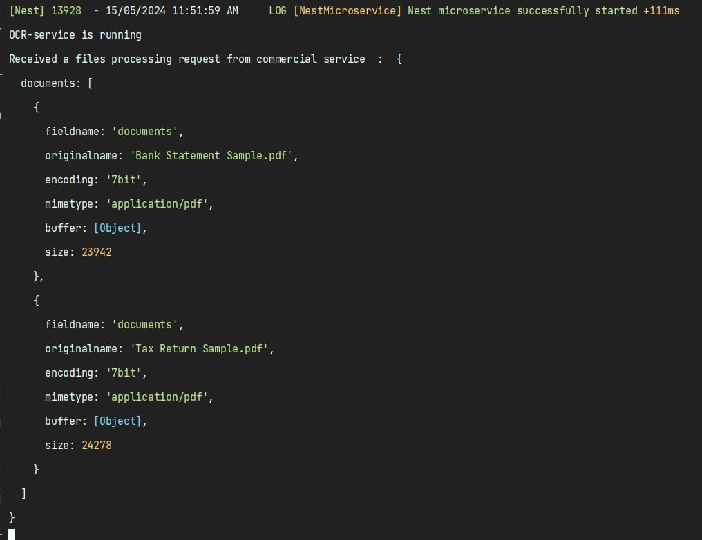
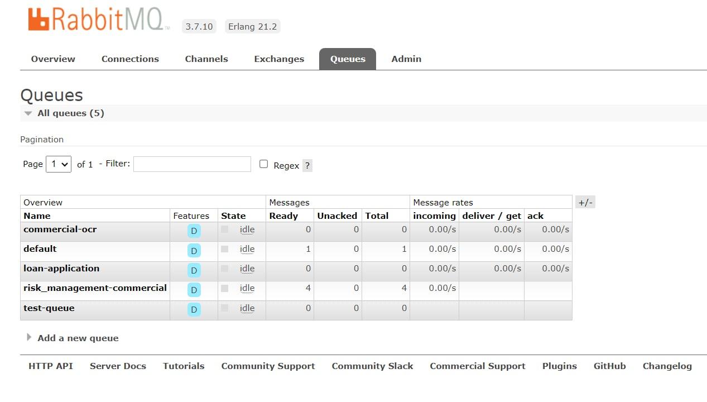

# Loan Application
## Reactive Microservices Architecture
By : **Mohamed Lasswed** - **Oumayma Ouerfelli**

The INSATx team has been asked to build a loan management module of an existing banking application in order to automate the following steps of a loan process:

The client fills in the application form and uploads the list of required documents.
The loan application is first processed by the commercial service, whose task is to check the eligibility of the borrower and the repayment terms and period, based on the borrower’s income and financial situation. An initial scoring is established to assess the eligibility of the client to get the loan.
Once done, the client application is then processed by the risk management service in order to make sure that the suggested debt ratio is sufficient enough to maintain a healthy bank account balance for the borrower and that the loan can still be repaid in full as scheduled. This service also has access to the central bank database in order to assess if there are other outstanding commitments with other banks that have not been paid. The output of this service is a final score which dictates if the borrower’s request should be approved or not.
The client is then notified whether his application for a loan has been approved (in principle) or not. Next, the final step will be established by the credit service that elaborates the credit agreement to be signed and the amortization table. Both documents can be later viewed/downloaded by the client.
Note that the commercial service and the risk management one should use some OCR capabilities in order to automate the extraction and processing of the needed information within the uploaded documents.

## Global Architecture :

## Implementation :

We leveraged **NestJS** and **RabbitMQ** to construct our reactive microservices architecture application. NestJS, a progressive Node.js framework, facilitated seamless development with its modular and intuitive structure, enabling us to build scalable and maintainable applications. Its reliance on TypeScript ensured robust typing and enhanced developer productivity.

Additionally, RabbitMQ served as our messaging broker, providing reliable message queuing functionality essential for asynchronous communication between microservices. Its support for multiple messaging protocols, including AMQP, ensured interoperability and facilitated the integration of various systems. With features such as message acknowledgments, delivery guarantees, and fault tolerance mechanisms, RabbitMQ ensured the resilience and responsiveness of our application, making it an ideal choice for our microservices architecture.

## Implemented flow :
### Loan Management module

This module accepts client applications along with their associated documents and forwards them to a queue, where the Commercial service is listening.

### Commercial Service Module
This module fetches applications from the loan application queue and transfers them to the commercial-ocr queue. This enables the OCR service to process the applications effectively.

Additionally, it calculates an initial score and sends it to risk management queue.

### OCR Module

This module fetches applications from the ocr-queue, extracts information from the documents, and places the results in the processed_files-commercial queue.

